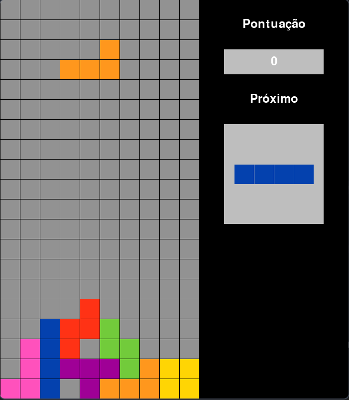

# Tetris em Python

Um clone clássico do Tetris desenvolvido com Python e Pygame CE.

## 📸 Preview



## 🚀 Como Executar

### Pré-requisitos
- Python 3.14+ (conforme definido no `pyproject.toml`)
- [Poetry](https://python-poetry.org/)

### Instalação
1. Clone o repositório
2. Instale as dependências:
   ```bash
   poetry install
   ```

### Execução
Inicie o jogo com o comando:
```bash
poetry run python tetris/main.py
```

## 🎮 Controles

- **A**: Mover para a esquerda
- **D**: Mover para a direita
- **X**: Girar peça
- **Z**: Desfazer rotação
- **Enter**: Reiniciar (após Game Over)

## 🛠️ Estrutura do Projeto

- `tetris/main.py`: Ponto de entrada do jogo.
- `tetris/game.py`: Lógica principal e estados do jogo.
- `tetris/grid.py`: Gerenciamento da grade do tabuleiro.
- `tetris/tetromino.py`: Classe base para as peças.
- `tetris/tetrominos.py`: Definições das peças específicas.
- `tetris/colors.py`: Definições de cores utilizadas.
- `tetris/position.py`: Utilitário para coordenadas.
